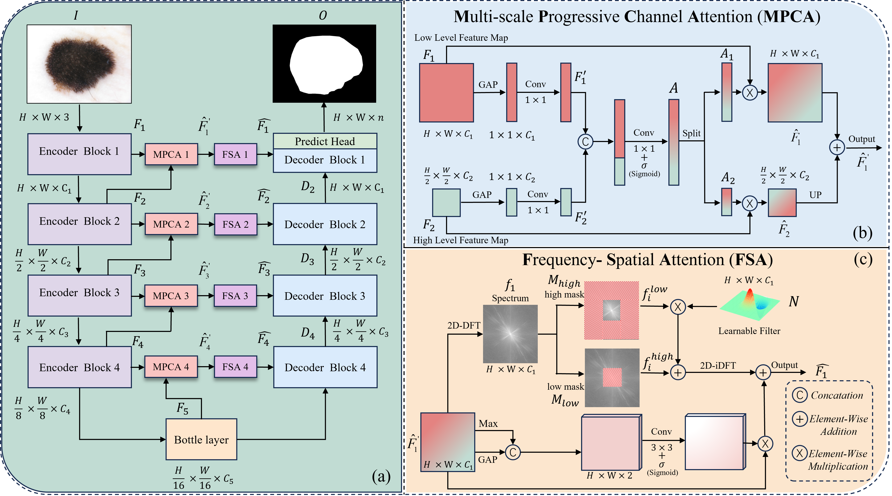

# Spatial-Frequency Dual Domain Attention Network For Medical Image Segmentation
Official implementation of the BIBM 2024 paper ["Spatial-Frequency Dual Domain Attention Network For Medical Image Segmentation"](https://ieeebibm.org/BIBM2024/)


## Citation
If you used SF_UNet in your own research, please give us a star and cite our paper below:

```
@INPROCEEDINGS{10822613,
  author={Zhou, Zhenhuan and He, Along and Wu, Yanlin and Yao, Rui and Xie, Xueshuo and Li, Tao},
  booktitle={2024 IEEE International Conference on Bioinformatics and Biomedicine (BIBM)}, 
  title={Spatial-Frequency Dual Domain Attention Network For Medical Image Segmentation}, 
  year={2024},
  volume={},
  number={},
  pages={4076-4081},
  keywords={Representation learning;Deep learning;Image segmentation;Accuracy;Codes;Shape;Frequency-domain analysis;Feature extraction;Lesions;Biomedical imaging;Medical Image Segmentation;Multi-scale Feature;Frequency Domain Attention;CNN;Deep Learning},
  doi={10.1109/BIBM62325.2024.10822613}}
```

## Acknowledgment
Code can only be used for ACADEMIC PURPOSES. NO COMERCIAL USE is allowed. Copyright © College of Computer Science, Nankai University. All rights reserved.
